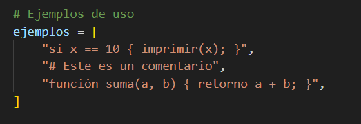
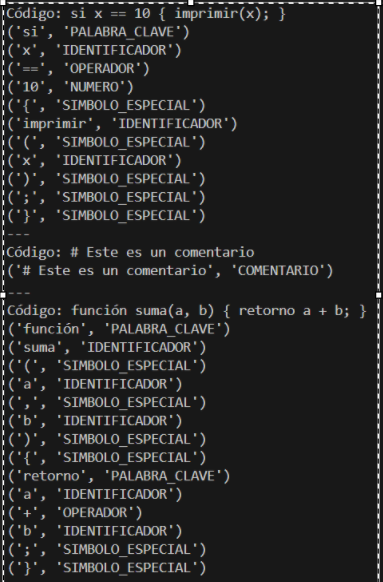

### Documentación del Analizador Léxico en Español

Este documento describe un analizador léxico (lexer) para un lenguaje de programación en español, basado en Python. El analizador reconoce varios tipos de tokens que son esenciales para el análisis sintáctico y semántico del código.

#### Tabla de Tokens

| Token       | Tipo              | Expresión Regular     |
|-------------|-------------------|-----------------------|
| `si`        | PALABRA_CLAVE     | `\bsi\b`              |
| `sino`      | PALABRA_CLAVE     | `\bsino\b`            |
| `mientras`  | PALABRA_CLAVE     | `\bmientras\b`        |
| `para`      | PALABRA_CLAVE     | `\bpara\b`            |
| `función`   | PALABRA_CLAVE     | `\bfunción\b`         |
| `retorno`   | PALABRA_CLAVE     | `\bretorno\b`         |
| `clase`     | PALABRA_CLAVE     | `\bclase\b`           |
| `importar`  | PALABRA_CLAVE     | `\bimportar\b`        |
| `verdadero` | PALABRA_CLAVE     | `\bverdadero\b`       |
| `falso`     | PALABRA_CLAVE     | `\bfalso\b`           |
| Identificador | IDENTIFICADOR   | `[a-zA-Z_][a-zA-Z0-9_]*` |
| Número      | NUMERO            | `\d+(\.\d+)?`         |
| Operadores  | OPERADOR          | `==|!=|<=|>=|<|>|=|\+|\-|\*|/` |
| Símbolos especiales | SIMBOLO_ESPECIAL | `[{}();,]`           |
| Comentario  | COMENTARIO        | `#.*`                 |
| Espacios en blanco | None       | `\s+`                 |

### Explicación

- **Palabras Clave**: Terminos reservados como `si`, `sino`, `mientras`, etc., se reconocen usando expresiones regulares específicas para cada palabra.
- **Identificadores**: Nombres de variables y funciones que comienzan con una letra o guion bajo y pueden contener números.
- **Números**: Enteros y decimales.
- **Operadores**: Aritméticos y de comparación.
- **Símbolos Especiales**: Paréntesis, llaves, punto y coma, etc.
- **Comentarios**: Todo lo que sigue al símbolo `#` hasta el final de la línea.
- **Espacios en Blanco**: Ignorados en el análisis léxico para simplificar la separación de tokens.

### Funcionamineto (Prueba numero 1 en terminal)
- **Sintaxis utilizada para el ejemplo**

- **Prueba en terminal**

El analizador léxico procesa el texto de entrada, identifica y clasifica cada token según las reglas definidas, y maneja errores léxicos cuando encuentra caracteres no reconocidos.

### Conclusión
El analizador léxico descrito aquí está diseñado para reconocer tokens en un lenguaje de programación en español. Utiliza expresiones regulares para identificar palabras clave, identificadores, números, operadores, símbolos especiales y comentarios. Este enfoque permite transformar un código fuente en una secuencia de tokens que pueden ser procesados por un analizador sintáctico y semántico para compilación o interpretación.
