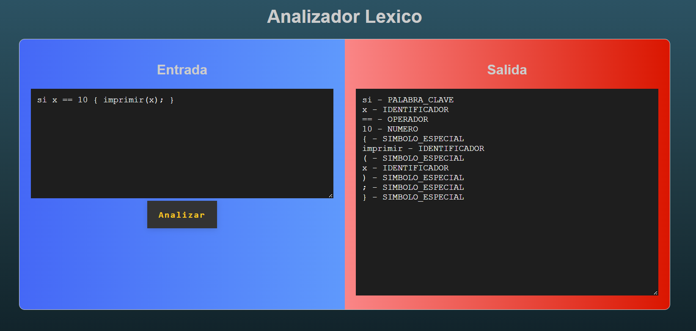
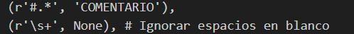

<p align="center">
  
</p>

<h1 align="center">INGENIERÍA EN SISTEMAS COMPUTACIONALES</h1>

<h2 align="center">SISTEMAS OPERATIVOS</h2>

<p align="center">
<b>NOMBRE DE LA ASIGNATURA:</b><br>
SISTEMAS OPERATIVOS
</p>

<p align="center">
<b>INTEGRANTES DEL EQUIPO:</b><br>
 Martin Feria Vázquez - 21200594<br>
 Ramírez Hernández Josué - 21200990<br>
 Valdez Zuñiga Leonardo Vicente - 24200196<br>
 Zeron López Germán Eduardo - 21200642
</p>

<p align="center">
<b>PROFESOR DE LA MATERIA:</b><br>
Ing. Rodolfo Baumé Lazcano
</p>

<p align="center">
<b>PACHUCA, HIDALGO, 14 DE MAYO DEL 2024</b>
</p>

<p align="center">
<b>INSTITUTO TECNOLÓGICO DE PACHUCA</b><br>
<i>“El hombre alimenta el ingenio en contacto con la Ciencia”</i>
</p>

---

## Índice

1. [Propósito](#propósito)
2. [¿Qué es un analizador léxico?](#qué-es-un-analizador-léxico)
3. [Definición de Tokens](#definición-de-tokens)
   - [Definición del lenguaje (PyEspañol)](#definición-del-lenguaje-pyespañol)
   - [Especificación de tokens para PyEspañol](#especificación-de-tokens-para-pyespañol)
   - [Patrones regulares para cada tipo de token (en formato regex)](#patrones-regulares-para-cada-tipo-de-token-en-formato-regex)
4. [Tabla de Tokens](#tabla-de-tokens)
5. [Expresiones regulares](#expresiones-regulares)
   - [Tabla de Tokens con sus expresiones regulares y breve explicación](#tabla-de-tokens-con-sus-expresiones-regulares-y-breve-explicación)
   - [Palabras Clave](#palabras-clave)
   - [Identificadores](#identificadores)
   - [Números](#números)
   - [Operadores](#operadores)
   - [Símbolos Especiales](#símbolos-especiales)
   - [Comentarios](#comentarios)
6. [Manejo de Espacios en Blanco y Comentarios](#manejo-de-espacios-en-blanco-y-comentarios)
7. [Prioridad de Coincidencia](#prioridad-de-coincidencia)
8. [Acciones Asociadas a los Tokens](#acciones-asociadas-a-los-tokens)
9. [Manejo de errores](#manejo-de-errores)
10. [Documentación del código](#documentación-del-código)
    - [Metadatos del Documento](#metadatos-del-documento)
    - [Estructura del Cuerpo](#estructura-del-cuerpo)
    - [Código PyScript](#código-pyscript)
    - [Código JavaScript](#código-javascript)
11. [Conclusión](#conclusión)
12. [Interface Gráfica o Aplicación](#interface-gráfica-o-aplicación)
13. [Repositorio en el cual se trabajó](#repositorio-en-el-cual-se-trabajó)
14. [Referencias](#referencias)

---

## Propósito

El propósito de este trabajo es desarrollar un analizador léxico que identifique y categorice diferentes componentes léxicos (tokens) en un lenguaje de programación en español. Este enfoque puede ser beneficioso en entornos educativos y comunidades de programación hispanohablantes. Python es elegido como base debido a su simplicidad y legibilidad, lo que facilita la implementación y comprensión del analizador.

<p align="center">
  
</p>

---

## ¿Qué es un analizador léxico?

El analizador léxico es un componente fundamental en el proceso de compilación o interpretación de un lenguaje de programación. Toma como entrada un texto y lo descompone en una secuencia de tokens basados en patrones definidos. Aquí se detallan todos los pasos y se documenta exhaustivamente cada componente.

<p align="center">
  
</p>

---

## Definición de Tokens

### Definición del lenguaje (PyEspañol):

- **Palabras clave:** "si", "sino", "mientras", "para", "función", "retorno", "clase", "importar", "verdadero", "falso"
- **Identificadores:** Secuencias de letras y números que comienzan con una letra (Variables).
- **Números:** Secuencias de dígitos enteros (0-9).
- **Operadores:** "+", "-", "*", "/", "=", "==", "<", ">"
- **Símbolos especiales:** "(", ")", "{", "}", ";"
- **Comentarios:** Se pueden denotar con "#" para comentarios de una sola línea.

### Especificación de tokens para PyEspañol:

- **Palabras clave:** `si|sino|mientras|para|función|retorno|clase|importar|verdadero|falso`
- **Identificadores:** `[a-zA-Z][a-zA-Z0-9]*`
- **Números:** `\d+(\.\d+)?`
- **Operadores:** `\+|\-|\*|\/|=|==|<|>`
- **Símbolos especiales:** `\(|\)|\{|\}|\;`
- **Comentarios:** `#.*`

### Patrones regulares para cada tipo de token (en formato regex):

- **Palabras clave:** `\b(si|sino|mientras|para|función|retorno|clase|importar|verdadero|falso)\b`
- **Identificadores:** `[a-zA-Z][a-zA-Z0-9]*`
- **Números:** `\d+(\.\d+)?`
- **Operadores:** `==|!=|<=|>=|<|>|=|\+|\-|\*|\/`
- **Símbolos especiales:** `[{}();,]`
- **Comentarios:** `#.*`

---

## Tabla de Tokens

| TOKEN    | Tipo            |
|----------|-----------------|
| Si       | Palabra Clave   |
| Sino     | Palabra Clave   |
| Mientras | Palabra Clave   |
| Para     | Palabra Clave   |
| Función  | Palabra Clave   |
| Retorno  | Palabra Clave   |
| Clase    | Palabra Clave   |
| Importar | Palabra Clave   |
| Verdadero| Palabra Clave   |
| Falso    | Palabra Clave   |
| Variable | Identificador   |
| 1-9      | Número          |
| +        | Operador        |
| -        | Operador        |
| *        | Operador        |
| /        | Operador        |
| =        | Operador        |
| ==       | Operador        |
| <        | Operador        |
| >        | Operador        |
| (        | Símbolo Especial|
| )        | Símbolo Especial|
| {        | Símbolo Especial|
| }        | Símbolo Especial|
| ;        | Símbolo Especial|
| #        | Comentario      |

---

## Expresiones regulares

### Tabla de Tokens con sus expresiones regulares y breve explicación

Hemos definido una serie de tokens que nuestro analizador léxico debe reconocer. Estos tokens se clasifican en diferentes categorías: palabras clave, identificadores, números, operadores, símbolos especiales y comentarios. A continuación se presenta la tabla de tokens con su tipo y expresión regular correspondiente.

| Token         | Tipo            | Expresión Regular        | Explicación                                                |
|---------------|-----------------|--------------------------|------------------------------------------------------------|
| si            | PALABRA_CLAVE   | `\bsi\b`                 | Coincide con "si", utilizado para condicionales (equivalente a "if"). |
| sino          | PALABRA_CLAVE   | `\bsino\b`               | Coincide con "sino", utilizado para condicionales alternativos (equivalente a "else"). |
| mientras      | PALABRA_CLAVE   | `\bmientras\b`           | Coincide con "mientras", utilizado para bucles (equivalente a "while"). |
| para          | PALABRA_CLAVE   | `\bpara\b`               | Coincide con "para", utilizado para bucles (equivalente a "for"). |
| función       | PALABRA_CLAVE   | `\bfunción\b`            | Coincide con "función", utilizado para definir funciones (equivalente a "def"). |
| retorno       | PALABRA_CLAVE   | `\bretorno\b`            | Coincide con "retorno", utilizado para devolver valores de funciones (equivalente a "return"). |
| clase         | PALABRA_CLAVE   | `\bclase\b`              | Coincide con "clase", utilizado para definir clases (equivalente a "class"). |
| importar      | PALABRA_CLAVE   | `\bimportar\b`           | Coincide con "importar", utilizado para importar módulos (equivalente a "import"). |
| verdadero     | PALABRA_CLAVE   | `\bverdadero\b`          | Coincide con "verdadero", valor booleano verdadero (equivalente a "true"). |
| falso         | PALABRA_CLAVE   | `\bfalso\b`              | Coincide con "falso", valor booleano falso (equivalente a "false").
| Identificador | IDENTIFICADOR | `[a-zA-Z_][a-zA-Z0-9_]*` | Coincide con nombres de variables y funciones

. Deben comenzar con una letra o guion bajo. |
| Número    | NÚMERO          | `\d+(\.\d+)?`            | Coincide con enteros y números de punto flotante.              |
| +         | OPERADOR        | `\+`                     | Coincide con el operador de suma.                              |
| -         | OPERADOR        | `\-`                     | Coincide con el operador de resta.                             |
| *         | OPERADOR        | `\*`                     | Coincide con el operador de multiplicación.                    |
| /         | OPERADOR        | `\/`                     | Coincide con el operador de división.                          |
| =         | OPERADOR        | `=`                      | Coincide con el operador de asignación.                        |
| ==        | OPERADOR        | `==`                     | Coincide con el operador de igualdad.                          |
| <         | OPERADOR        | `<`                      | Coincide con el operador menor que.                            |
| >         | OPERADOR        | `>`                      | Coincide con el operador mayor que.                            |
| (         | SÍMBOLO_ESPECIAL | `\(`                     | Coincide con el paréntesis izquierdo.                          |
| )         | SÍMBOLO_ESPECIAL | `\)`                     | Coincide con el paréntesis derecho.                            |
| {         | SÍMBOLO_ESPECIAL | `\{`                     | Coincide con la llave izquierda.                               |
| }         | SÍMBOLO_ESPECIAL | `\}`                     | Coincide con la llave derecha.                                 |
| ;         | SÍMBOLO_ESPECIAL | `;`                      | Coincide con el punto y coma.                                  |
| Comentario | COMENTARIO      | `#.*`                    | Coincide con cualquier comentario de una sola línea.           |

### Palabras Clave

Las palabras clave son términos reservados en el lenguaje PyEspañol que tienen un significado especial y no pueden ser utilizados como identificadores.

- **Expresión regular:** `\b(si|sino|mientras|para|función|retorno|clase|importar|verdadero|falso)\b`

### Identificadores

Los identificadores son nombres utilizados para variables, funciones, clases, etc. Deben comenzar con una letra o guion bajo y pueden contener letras, dígitos y guiones bajos.

- **Expresión regular:** `[a-zA-Z_][a-zA-Z0-9_]*`

### Números

Los números pueden ser enteros o de punto flotante.

- **Expresión regular:** `\d+(\.\d+)?`

### Operadores

Los operadores realizan diversas operaciones aritméticas y lógicas.

- **Expresión regular:** `\+|\-|\*|\/|=|==|<|>`

### Símbolos Especiales

Los símbolos especiales son caracteres individuales que tienen un significado específico en el lenguaje PyEspañol.

- **Expresión regular:** `[{}();,]`

### Comentarios

Los comentarios son anotaciones en el código que no afectan la ejecución del programa. Comienzan con el carácter `#` y continúan hasta el final de la línea.

- **Expresión regular:** `#.*`

<p align="center">
  
</p>

---

## Manejo de Espacios en Blanco y Comentarios

En nuestro analizador léxico, los espacios en blanco (espacios, tabulaciones y nuevas líneas) y los comentarios son ignorados ya que no aportan información semántica al análisis léxico del código fuente. 

- **Expresión regular para espacios en blanco:** `\s+`
- **Expresión regular para comentarios:** `#.*`

**Codigo:**
<p align="center">
  
</p>

**Interface:**
<p align="center">
  
</p>

---

## Prioridad de Coincidencia

La prioridad de coincidencia se maneja asegurando que las expresiones regulares para tokens más específicos se prueben antes que las más generales. Por ejemplo, las palabras clave deben coincidir antes que los identificadores, ya que una palabra clave también puede coincidir con la expresión regular para un identificador.

<p align="center">
  
</p>

---

## Acciones Asociadas a los Tokens

Las acciones asociadas a cada token incluyen su categorización y almacenamiento en una estructura adecuada, generalmente una lista o un objeto de tipo diccionario, para su posterior procesamiento por el analizador sintáctico.

<p align="center">
  
</p>

---

## Manejo de errores

El manejo de errores en el analizador léxico implica la detección y notificación de secuencias de caracteres que no coinciden con ningún patrón de token válido. Esto puede incluir caracteres inválidos o secuencias de caracteres que no conforman un token reconocido. Al encontrar un error, el analizador debe proporcionar un mensaje de error claro y, de ser posible, la ubicación del error en el código fuente.

**Codigo:**
<p align="center">
  
</p>

**Interface:**
<p align="center">
  
</p>

---

## Documentación del código

### Metadatos del Documento

El documento incluye información como el título del proyecto, el nombre de la asignatura, los nombres de los integrantes del equipo, el profesor de la materia y la fecha de presentación.

### Estructura del Cuerpo

El cuerpo del documento está organizado en secciones que detallan cada aspecto del proyecto, desde la definición de tokens hasta el manejo de errores y la documentación del código.

### Código PyScript

El código del analizador léxico se implementará en Python, utilizando expresiones regulares para identificar y categorizar tokens.

```python
import re

# Definición de las expresiones regulares para los diferentes tipos de tokens
token_specification = [
    ('PALABRA_CLAVE', r'\b(si|sino|mientras|para|función|retorno|clase|importar|verdadero|falso)\b'),
    ('IDENTIFICADOR', r'[a-zA-Z_][a-zA-Z0-9_]*'),
    ('NUMERO', r'\d+(\.\d+)?'),
    ('OPERADOR', r'\+|\-|\*|\/|==|=|<|>'),
    ('SIMBOLO', r'[{}();,]'),
    ('COMENTARIO', r'#.*'),
    ('ESPACIO_BLACO', r'\s+'),
]

# Compilación de las expresiones regulares
token_regex = '|'.join(f'(?P<{name}>{regex})' for name, regex in token_specification)

def analizar_lexico(codigo):
    tokens = []
    for match in re.finditer(token_regex, codigo):
        tipo = match.lastgroup
        valor = match.group(tipo)
        if tipo != 'ESPACIO_BLACO' and tipo != 'COMENTARIO':
            tokens.append((tipo, valor))
    return tokens

# Ejemplo de uso del analizador léxico
codigo_fuente = '''
si x > 10:
    imprimir("x es mayor que 10")
'''

tokens = analizar_lexico(codigo_fuente)
for token in tokens:
    print(token)
```

### Código JavaScript

La documentación también puede incluir ejemplos de cómo se implementaría un analizador léxico similar en JavaScript, utilizando el mismo enfoque de expresiones regulares.

```javascript
const tokenSpecification = [
    ['PALABRA_CLAVE', /\b(si|sino|mientras|para|función|retorno|clase|importar|verdadero|falso)\b/],
    ['IDENTIFICADOR', /[a-zA-Z_][a-zA-Z0-9_]*/],
    ['NUMERO', /\d+(\.\d+)?/],
    ['OPERADOR', /\+|\-|\*|\/|==|=|<|>/],
    ['SIMBOLO', /[{}();,]/],
    ['COMENTARIO', /#.*/],
    ['ESPACIO_BLACO', /\s+/],
];

function analizarLexico(codigo) {
    let tokens = [];
    let regex = new RegExp(tokenSpecification.map(([name, regex]) => `(?<${name}>${regex.source})`).join('|'), 'g');
    let match;
    while (match = regex.exec(codigo)) {
        for (let name in match.groups) {
            if (match.groups[name] && name !== 'ESPACIO_BLACO' && name !== 'COMENTARIO') {
                tokens.push([name, match.groups[name]]);
            }
        }
    }
    return tokens;
}

// Ejemplo de uso del analizador léxico
let codigoFuente = `
si x > 10:
    imprimir("x es mayor que 10")
`;

let tokens = analizarLexico(codigoFuente);
tokens.forEach(token => console.log(token));
```

---

## Conclusión

El desarrollo de un analizador léxico para un lenguaje de programación en español es una tarea desafiante pero gratificante que puede fomentar la enseñanza y la adopción de la programación en comunidades hispanohablantes. Este proyecto demuestra cómo las expresiones regulares y los principios de los compiladores pueden aplicarse para crear una herramienta útil y educativa.

---

### Interface Grafica o Aplicacion:
https://martinfv-001.github.io/AL/

--- 

### Repositorio en el cual se trabajo:
https://github.com/MartinFV-001/AL

---

## Referencias

- Tutor de programación. (2014, February 20). Analizador Léxico. Blogspot.com; Blogger. https://acodigo.blogspot.com/2014/02/analizador-lexico.html (Referencia)
- Analizador Léxico: Implementación en Java. (2013, July 23). Learnercys; learnercys. https://learnercys.wordpress.com/2013/07/23/analizador-lexico-implementacion-en-java/ (Referencia)
- Anaconda Inc. (2022). Pyscript.net. Pyscript.net. https://pyscript.net/ (Una plataforma para correr archivos Pyrhon en el navegador)
- 1483 Buttons: CSS & Tailwind. (2023). Uiverse.io. https://uiverse.io/buttons?page=2 (Diseño de boton)
- uiGradients - Beautiful colored gradients. (2024). UiGradients. https://uigradients.com/#BlueRaspberry (Diseño de los fondos)


