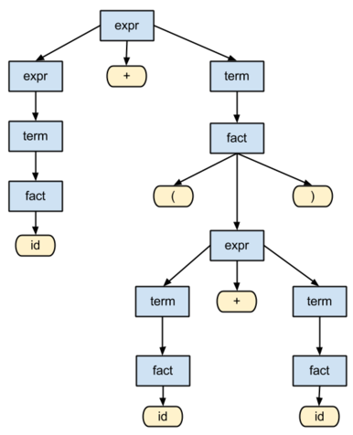

  

<h1 align="center">INGENIERÍA EN SISTEMAS COMPUTACIONALES</h1>

<h2 align="center">Proyecto Analizador Sintactico PyEspañol</h2>

<b>NOMBRE DE LA ASIGNATURA:</b> 
Lenguaje y Automatas I

<b>INTEGRANTES DEL EQUIPO:</b> 
 Martin Feria Vázquez - 21200594 
 Ramírez Hernández Josué - 21200990 
 Valdez Zuñiga Leonardo Vicente - 24200196 
 Zeron López Germán Eduardo - 21200642

<b>PROFESOR DE LA MATERIA:</b> 
Ing. Rodolfo Baumé Lazcano

<b>PACHUCA, HIDALGO, 27 DE MAYO DEL 2024</b>

<b>INSTITUTO TECNOLÓGICO DE PACHUCA</b> 
<i>“El hombre alimenta el ingenio en contacto con la Ciencia”</i>

---

## Índice
1. [Propósito](#propósito)
2. [¿Qué es un analizador sintáctico?](#qué-es-un-analizador-sintactico)
3. [Descripción Detallada de la Gramática](#descripción-detallada-de-la-gramática)
4. [Definición de Tokens](#definición-de-tokens)
5. [Tabla de Tokens](#tabla-de-tokens)
6. [Expresiones regulares](#expresiones-regulares)
7. [Manejo de Espacios en Blanco y Comentarios](#manejo-de-espacios-en-blanco-y-comentarios)
8. [Prioridad de Coincidencia](#prioridad-de-coincidencia)
9. [Acciones Asociadas a los Tokens](#acciones-asociadas-a-los-tokens)
10. [Manejo de errores](#manejo-de-errores)
11. [Conclusión](#conclusión)
12. [Interface Gráfica o Aplicación](#interface-gráfica-o-aplicación)
13. [Repositorio en el cual se trabajó](#repositorio-en-el-cual-se-trabajó)
14. [Referencias](#referencias)

---

<h2 style="text-align: center;" id="propósito">Propósito</h2>

El analizador sintáctico se encarga de verificar la estructura gramatical del código fuente, asegurando que esté conforme a las reglas del lenguaje de programación. Este proceso es crucial en la fase de compilación o interpretación del lenguaje, ya que una correcta sintaxis es fundamental para la correcta ejecución del programa.

    

---

<h2 style="text-align: center;" id="qué-es-un-analizador-sintactico">¿Qué es un analizador sintáctico?</h2>

Un analizador sintáctico o parser (viene del inglés: parse - analizar una cadena o texto en componentes sintácticos lógicos) es un programa que normalmente es parte de un compilador. El compilador se asegura de que el código se traduce correctamente a un lenguaje ejecutable.

    

---

<h2 style="text-align: center;" id="descripción-detallada-de-la-gramática">Descripción Detallada de la Gramática</h2>

<h3 style="text-align: center;">Gramática del Lenguaje PyEspañol</h3>

El lenguaje PyEspañol es un lenguaje de programación diseñado para ser similar a Python pero adaptado al idioma español. A continuación se provee una descripción clara y completa de la gramática del lenguaje, especificando todas las producciones y reglas necesarias para la correcta implementación del analizador sintáctico.

<h3 style="text-align: center;">Definición de la Gramática</h3>

La gramática de PyEspañol se define utilizando notación BNF (Backus-Naur Form), que es comúnmente empleada para especificar la sintaxis de los lenguajes de programación. Esta gramática define las reglas que describen cómo se pueden construir las sentencias y expresiones válidas en PyEspañol.

<h3 style="text-align: center;">Producciones y Reglas</h3>

<h4 style="text-align: center;">Programa</h4>

Un programa en PyEspañol consiste en una secuencia de declaraciones.

<pre><code>&lt;programa&gt; ::= &lt;declaracion&gt;*</code></pre>

<h4 style="text-align: center;">Declaraciones</h4>

Las declaraciones pueden ser declaraciones de control, declaraciones de función, declaraciones de clase, o declaraciones simples como asignaciones y expresiones.

<pre><code>&lt;declaracion&gt; ::= &lt;declaracion_control&gt;
                | &lt;declaracion_funcion&gt;
                | &lt;declaracion_clase&gt;
                | &lt;declaracion_simple&gt;</code></pre>

<h4 style="text-align: center;">Declaraciones de Control</h4>

Las declaraciones de control incluyen estructuras de decisión (<code>si</code>, <code>sino</code>) y bucles (<code>mientras</code>, <code>para</code>).

<pre><code>&lt;declaracion_control&gt; ::= &lt;declaracion_si&gt;
                        | &lt;declaracion_mientras&gt;
                        | &lt;declaracion_para&gt;

&lt;declaracion_si&gt; ::= "si" &lt;expresion&gt; "{" &lt;declaracion&gt;* "}" &lt;declaracion_sino&gt;?
&lt;declaracion_sino&gt; ::= "sino" "{" &lt;declaracion&gt;* "}"

&lt;declaracion_mientras&gt; ::= "mientras" &lt;expresion&gt; "{" &lt;declaracion&gt;* "}"

&lt;declaracion_para&gt; ::= "para" &lt;identificador&gt; "en" &lt;expresion&gt; "{" &lt;declaracion&gt;* "}"</code></pre>

<h4 style="text-align: center;">Declaraciones de Función</h4>

Las funciones se declaran utilizando la palabra clave <code>función</code>.

<pre><code>&lt;declaracion_funcion&gt; ::= "función" &lt;identificador&gt; "(" &lt;parametros&gt;? ")" "{" &lt;declaracion&gt;* "retorno"? &lt;expresion&gt;? "}"

&lt;parametros&gt; ::= &lt;identificador&gt; ("," &lt;identificador&gt;)*</code></pre>

<h4 style="text-align: center;">Declaraciones de Clase</h4>

Las clases se declaran utilizando la palabra clave <code>clase</code>.

<pre><code>&lt;declaracion_clase&gt; ::= "clase" &lt;identificador&gt; "{" &lt;declaracion&gt;* "}"</code></pre>

<h4 style="text-align: center;">Declaraciones Simples</h4>

Las declaraciones simples incluyen asignaciones y expresiones.

<pre><code>&lt;declaracion_simple&gt; ::= &lt;asignacion&gt;
                       | &lt;expresion&gt;

&lt;asignacion&gt; ::= &lt;identificador&gt; "=" &lt;expresion&gt;</code></pre>

<h4 style="text-align: center;">Expresiones</h4>

Las expresiones pueden ser operaciones aritméticas, lógicas, llamadas a función, o simples identificadores y literales.

<pre><code>&lt;expresion&gt; ::= &lt;expresion_logica&gt;

&lt;expresion_logica&gt; ::= &lt;expresion_igualdad&gt;
                     | &lt;expresion_logica&gt; ("y" | "o") &lt;expresion_igualdad&gt;

&lt;expresion_igualdad&gt; ::= &lt;expresion_relacional&gt;
                       | &lt;expresion_igualdad&gt; ("==" | "!=") &lt;expresion_relacional&gt;

&lt;expresion_relacional&gt; ::= &lt;expresion_aditiva&gt;
                         | &lt;expresion_relacional&gt; ("&lt;" | "&gt;" | "&lt;=" | "&gt;=") &lt;expresion_aditiva&gt;

&lt;expresion_aditiva&gt; ::= &lt;expresion_multiplicativa&gt;
                      | &lt;expresion_aditiva&gt; ("+" | "-") &lt;expresion_multiplicativa&gt;

&lt;expresion_multiplicativa&gt; ::= &lt;expresion_unaria&gt;
                             | &lt;expres

ion_multiplicativa&gt; ("*" | "/") &lt;expresion_unaria&gt;

&lt;expresion_unaria&gt; ::= ("-" | "!") &lt;expresion_unaria&gt;
                     | &lt;llamada_funcion&gt;
                     | &lt;literal&gt;
                     | &lt;identificador&gt;

&lt;llamada_funcion&gt; ::= &lt;identificador&gt; "(" &lt;argumentos&gt;? ")"

&lt;argumentos&gt; ::= &lt;expresion&gt; ("," &lt;expresion&gt;)*

&lt;literal&gt; ::= &lt;numero&gt;
               | &lt;cadena&gt;
               | "verdadero"
               | "falso"</code></pre>

<h4 style="text-align: center;">Identificadores y Literales</h4>

Los identificadores son secuencias de letras y números que comienzan con una letra. Los literales incluyen números, cadenas y valores booleanos.

<pre><code>&lt;identificador&gt; ::= [a-zA-Z][a-zA-Z0-9]*

&lt;numero&gt; ::= \d+(\.\d+)?

&lt;cadena&gt; ::= "([^"\\]*(\\.[^"\\]*)*)"</code></pre>

---

<h2 style="text-align: center;" id="definición-de-tokens">Definición de Tokens</h2>
<h3 style="text-align: center;">Definición del lenguaje (PyEspañol):</h3>
<ul>
    <li><strong>Palabras clave:</strong> "si", "sino", "mientras", "para", "función", "retorno", "clase", "importar", "verdadero", "falso"</li>
    <li><strong>Identificadores:</strong> Secuencias de letras y números que comienzan con una letra (Variables).</li>
    <li><strong>Números:</strong> Secuencias de dígitos enteros (0-9).</li>
    <li><strong>Operadores:</strong> "+", "-", "*", "/", "=", "==", "&lt;", "&gt;"</li>
    <li><strong>Símbolos especiales:</strong> "(", ")", "{", "}", ";"</li>
    <li><strong>Comentarios:</strong> Se pueden denotar con "#" para comentarios de una sola línea.</li>
</ul>

<h3 style="text-align: center;">Especificación de tokens para PyEspañol:</h3>
<ul>
    <li><strong>Palabras clave:</strong> <code>si|sino|mientras|para|función|retorno|clase|importar|verdadero|falso</code></li>
    <li><strong>Identificadores:</strong> <code>[a-zA-Z][a-zA-Z0-9]*</code></li>
    <li><strong>Números:</strong> <code>\d+(\.\d+)?</code></li>
    <li><strong>Operadores:</strong> <code>\+|\-|\*|\/|=|==|&lt;|&gt;</code></li>
    <li><strong>Símbolos especiales:</strong> <code>\(|\)|\{|\}|\;</code></li>
    <li><strong>Comentarios:</strong> <code>#.*</code></li>
</ul>

<h3 style="text-align: center;">Patrones regulares para cada tipo de token (en formato regex):</h3>
<ul>
    <li><strong>Palabras clave:</strong> <code>\b(si|sino|mientras|para|función|retorno|clase|importar|verdadero|falso)\b</code></li>
    <li><strong>Identificadores:</strong> <code>[a-zA-Z][a-zA-Z0-9]*</code></li>
    <li><strong>Números:</strong> <code>\d+(\.\d+)?</code></li>
    <li><strong>Operadores:</strong> <code>==|!=|&lt;=|&gt;=|&lt;|&gt;|=|\+|\-|\*|\/</code></li>
    <li><strong>Símbolos especiales:</strong> <code>[{}();,]</code></li>
    <li><strong>Comentarios:</strong> <code>#.*</code></li>
</ul>

---

<h2 style="text-align: center;" id="tabla-de-tokens">Tabla de Tokens</h2>

| TOKEN    | Tipo            |
|----------|-----------------|
| Si       | Palabra Clave   |
| Sino     | Palabra Clave   |
| Mientras | Palabra Clave   |
| Para     | Palabra Clave   |
| Función  | Palabra Clave   |
| Retorno  | Palabra Clave   |
| Clase    | Palabra Clave   |
| Importar | Palabra Clave   |
| Verdadero| Palabra Clave   |
| Falso    | Palabra Clave   |
| Variable | Identificador   |
| 1-9      | Número          |
| +        | Operador        |
| -        | Operador        |
| *        | Operador        |
| /        | Operador        |
| =        | Operador        |
| ==       | Operador        |
| <        | Operador        |
| >        | Operador        |
| (        | Símbolo Especial|
| )        | Símbolo Especial|
| {        | Símbolo Especial|
| }        | Símbolo Especial|
| ;        | Símbolo Especial|
| #        | Comentario      |

---
<h2 style="text-align: center;" id="expresiones-regulares">Expresiones regulares</h2>

Las expresiones regulares son utilizadas para definir patrones en cadenas de caracteres. Se emplean para reconocer los diferentes tokens en el código fuente del lenguaje PyEspañol.

<ul>
    <li><strong>Palabras clave:</strong> <code>\b(si|sino|mientras|para|función|retorno|clase|importar|verdadero|falso)\b</code></li>
    <li><strong>Identificadores:</strong> <code>[a-zA-Z][a-zA-Z0-9]*</code></li>
    <li><strong>Números:</strong> <code>\d+(\.\d+)?</code></li>
    <li><strong>Operadores:</strong> <code>==|!=|&lt;=|&gt;=|&lt;|&gt;|=|\+|\-|\*|\/</code></li>
    <li><strong>Símbolos especiales:</strong> <code>[{}();,]</code></li>
    <li><strong>Comentarios:</strong> <code>#.*</code></li>
</ul>

    

---

<h2 style="text-align: center;" id="manejo-de-espacios-en-blanco-y-comentarios">Manejo de Espacios en Blanco y Comentarios</h2>
  

Los comentarios en el código fuente se manejan mediante la expresión regular r'#.*'. Estos son ignorados completamente por el analizador léxico, ya que están asociados a None.

    

---

<h2 style="text-align: center;" id="prioridad-de-coincidencia">Prioridad de Coincidencia</h2>

Cuando una misma secuencia de caracteres puede corresponder a múltiples tokens, se priorizan las coincidencias más largas. Esto se logra al ordenar las expresiones regulares de manera que las coincidencias más específicas aparezcan primero.

    

---

<h2 style="text-align: center;" id="acciones-asociadas-a-los-tokens">Acciones Asociadas a los Tokens</h2>

Las acciones asociadas a cada token incluyen la asignación de un tipo de token y la recopilación de información adicional, como el valor de un número. Si un carácter o secuencia no coincide con ningún patrón, se genera un error léxico.

    

---

<h2 style="text-align: center;" id="manejo-de-errores">Manejo de errores</h2>

Los errores de análisis léxico y sintáctico se manejan generando mensajes de error descriptivos y deteniendo el análisis. Esto asegura que los problemas en el código fuente se identifiquen y reporten de manera clara.

    

---

<h2 style="text-align: center;" id="conclusión">Conclusión</h2>

El analizador sintáctico es un componente indispensable en el proceso de compilación que aporta estructura y coherencia al análisis del código fuente. Su capacidad para verificar la corrección sintáctica, facilitar el análisis semánt

ico, y proporcionar una base para la optimización y generación de código, lo convierte en un pilar fundamental para la construcción de compiladores eficientes y robustos. A través de un análisis sintáctico riguroso, los compiladores pueden ofrecer herramientas más poderosas y amigables para los desarrolladores, contribuyendo significativamente a la calidad y eficiencia del software producido.

    

---

<h2 style="text-align: center;" id="interface-gráfica-o-aplicación">Interface Gráfica o Aplicación</h2>

Una interfaz gráfica de usuario (GUI) o una aplicación puede facilitar la interacción con el analizador léxico, permitiendo a los usuarios ingresar código y ver los resultados del análisis en tiempo real. Esta interfaz debe ser intuitiva y amigable para el usuario.

    

---

<h2 style="text-align: center;" id="repositorio-en-el-cual-se-trabajó">Repositorio en el cual se trabajó</h2>

El código fuente y la documentación del proyecto están disponibles en un repositorio en línea, accesible para todos los interesados en estudiar o contribuir al desarrollo del analizador léxico.

<strong>Repositorio:</strong> <a href="https://github.com/MartinFV-001/AnalizadorSintacticoLexico">https://github.com/MartinFV-001/AnalizadorSintacticoLexico</a>

<strong>Web:</strong> <a href="https://martinfv-001.github.io/AnalizadorSintacticoLexico/">https://martinfv-001.github.io/AnalizadorSintacticoLexico/</a>

---

<h2 style="text-align: center;" id="referencias">Referencias</h2>
<ol>
    <li>Aho, A. V., Lam, M. S., Sethi, R., & Ullman, J. D. (2006). Compilers: Principles, Techniques, and Tools (2nd ed.). Pearson.</li>
    <li>Analizador sintáctico de oraciones. (2023). Sintaxis.org. <a href="Https://sintaxis.org/analizador/‌">Https://sintaxis.org/analizador/</a></li>
    <li>Python Software Foundation. (2023). Python Language Reference, version 3.10.<a href="https://docs.python.org/3.10/reference/">https://docs.python.org/3.10/reference/</a></li>
</ol>
