# Investigacion y Mapa Conceptual sobre las Máquinas de Turing

## Índice
1. [Introducción](#introducción)
2. [Historia](#historia)
3. [Componentes Básicos](#componentes-básicos)
    1. [Tinta](#tinta)
    2. [Cabezal](#cabezal)
    3. [Estados](#estados)
    4. [Alfabeto](#alfabeto)
4. [Funcionamiento](#funcionamiento)
    1. [Movimiento del cabezal](#movimiento-del-cabezal)
    2. [Lectura y escritura de símbolos](#lectura-y-escritura-de-símbolos)
5. [Tipos de Máquinas de Turing](#tipos-de-máquinas-de-turing)
    1. [Determinísticas](#determinísticas)
    2. [No determinísticas](#no-determinísticas)
    3. [Universales](#universales)
6. [Importancia](#importancia)
    1. [Teoría de la computación](#teoría-de-la-computación)
    2. [Problemas que resuelve](#problemas-que-resuelve)
    3. [Limitaciones](#limitaciones)
    4. [Impacto en la teoría de la computación](#impacto-en-la-teoría-de-la-computación)
7. [Ejemplos](#ejemplos)
    1. [Problema de la parada](#problema-de-la-parada)
    2. [Aritmética básica](#aritmética-básica)
    3. [Reconocimiento de lenguajes formales](#reconocimiento-de-lenguajes-formales)
8. [Mapa Conceptual](#mapa-conceptual)
9. [Referencias](#referencias)

## Introducción
Una **Máquina de Turing** es un modelo abstracto de computación propuesto por el matemático y lógico británico Alan Turing en 1936. Este modelo teórico se utiliza para entender los límites de lo que puede ser computado. Las máquinas de Turing forman la base de la teoría de la computación y han influido profundamente en el desarrollo de la informática.

## Historia
Alan Turing introdujo el concepto de la máquina de Turing en su artículo "On Computable Numbers, with an Application to the Entscheidungsproblem" en 1936. Su trabajo fue fundamental para el desarrollo de la teoría de la computación y sentó las bases para la creación de las computadoras modernas. Turing es considerado uno de los padres de la informática y su modelo ha sido esencial para entender cómo las máquinas pueden procesar información y resolver problemas.

    

## Componentes Básicos

### Tinta
La cinta es un componente esencial de la máquina de Turing. Es infinita en longitud y se divide en celdas, cada una de las cuales puede contener un símbolo de un alfabeto finito. La cinta actúa como una memoria de almacenamiento y se utiliza tanto para leer como para escribir símbolos durante el proceso de computación.

    

### Cabezal
El cabezal es el componente que se mueve sobre la cinta. Puede moverse hacia la izquierda o hacia la derecha, una celda a la vez. Además, el cabezal puede leer el símbolo que se encuentra en la celda actual y escribir un nuevo símbolo en la misma celda. El movimiento del cabezal y las acciones de lectura y escritura son determinadas por el estado actual de la máquina y el símbolo leído.

    

### Estados
Los estados representan las diferentes configuraciones internas que puede tener la máquina de Turing en un momento dado. Cada estado dicta la acción que la máquina debe tomar cuando se encuentra en ese estado y lee un símbolo específico de la cinta. La máquina cambia de estado en función de estas acciones.

    

### Alfabeto
El alfabeto es el conjunto de todos los símbolos que la máquina de Turing puede leer y escribir en la cinta. Este conjunto incluye un símbolo especial que representa un espacio en blanco o una celda vacía. El alfabeto finito es crucial para definir las operaciones que la máquina puede realizar.

    

## Funcionamiento

### Movimiento del cabezal
El cabezal de la máquina de Turing se mueve a la izquierda o derecha en la cinta, una celda a la vez. El movimiento se basa en el estado actual de la máquina y el símbolo que está siendo leído en la cinta. Este movimiento es crucial para el funcionamiento de la máquina, ya que permite acceder a diferentes partes de la cinta para leer y escribir información.

    

### Lectura y escritura de símbolos
La máquina de Turing lee un símbolo de la celda actual en la cinta, luego realiza una acción basada en el símbolo leído y el estado actual. Esta acción puede incluir escribir un nuevo símbolo en la celda actual, mover el cabezal hacia la izquierda o hacia la derecha, y cambiar al siguiente estado. Este ciclo de lectura, escritura y movimiento continúa hasta que la máquina alcanza un estado de parada.

    

## Tipos de Máquinas de Turing

### Determinísticas
En una máquina de Turing determinística, cada configuración de estado y símbolo de entrada define de manera única la acción a tomar: qué símbolo escribir, hacia dónde mover el cabezal y a qué nuevo estado cambiar. Esto implica que la máquina seguirá un único camino de ejecución para una entrada dada.

    

### No determinísticas
Las máquinas de Turing no determinísticas permiten múltiples acciones posibles para una misma configuración de estado y símbolo de entrada. En lugar de seguir un solo camino de ejecución, la máquina puede explorar múltiples caminos simultáneamente. Este tipo de máquina es teórico y se utiliza principalmente para estudiar la complejidad computacional.

    

### Universales
Una máquina de Turing universal es una máquina que puede simular cualquier otra máquina de Turing. Esta capacidad de simulación significa que puede ejecutar cualquier algoritmo que cualquier máquina de Turing pueda ejecutar, dada una descripción adecuada de esa máquina y su entrada.

    

## Importancia

### Teoría de la computación
Las máquinas de Turing son fundamentales en la teoría de la computación. Proporcionan un modelo simple pero poderoso para entender qué problemas pueden ser resueltos por una computadora. Este modelo ha permitido a los teóricos definir y explorar conceptos clave como la decidibilidad, la complejidad y la computabilidad.

    

### Problemas que resuelve
Las máquinas de Turing pueden resolver una amplia gama de problemas computacionales. Desde operaciones matemáticas básicas hasta problemas complejos en teoría de números y álgebra. Su capacidad de simular cualquier algoritmo las hace herramientas extremadamente poderosas en la teoría de la computación.

    

### Limitaciones
A pesar de su poder, las máquinas de Turing tienen limitaciones. No pueden resolver todos los problemas. Por ejemplo, el problema de la parada, que consiste en determinar si una máquina de Turing se detendrá en una entrada dada, es indecidible. Esto significa que no existe un algoritmo general que pueda resolver este problema para todas las máquinas de Turing.

    

### Impacto en la teoría de la computación
El impacto de las máquinas de Turing en la teoría de la computación ha sido profundo. Han proporcionado una base para entender los límites de lo que las computadoras pueden hacer, influenciado el desarrollo de lenguajes de programación y guiado la creación de algoritmos eficientes.

    

## Ejemplos

### Problema de la parada
El problema de la parada es un famoso problema en la teoría de la computación. Consiste en determinar si una máquina de Turing con una entrada específica se detendrá o continuará ejecutándose indefinidamente. Alan Turing demostró que este problema es indecidible, lo que significa que no hay una máquina de Turing que pueda resolver este problema para todas las posibles entradas y máquinas.

    

### Aritmética básica
Las máquinas de Turing pueden realizar operaciones aritméticas básicas como sumas y restas. Por ejemplo, una máquina de Turing puede ser diseñada para sumar dos números naturales representados en una cinta, utilizando reglas de transición que modelan el proceso de adición.

    

### Reconocimiento de lenguajes formales
Las máquinas de Turing pueden ser utilizadas para reconocer lenguajes formales. Por ejemplo, una máquina de Turing puede determinar si una cadena pertenece a un lenguaje específico, como los lenguajes regulares o contextuales. Esto es fundamental en la teoría de autómatas y el diseño de compiladores.

    

## Mapa Conceptual

```mermaid
graph TD
  A[Máquinas de Turing]
  
  A --> B[Componentes Básicos]
  B --> B1[Tinta]
  B --> B2[Cabezal]
  B --> B3[Estados]
  B --> B4[Alfabeto]

  B1 --> B1a[La cinta es infinita y se usa para leer y escribir símbolos.]
  B2 --> B2a[Se mueve a la izquierda o derecha sobre la cinta.]
  B3 --> B3a[Configuraciones internas de la máquina.]
  B4 --> B4a[Conjunto de símbolos que la máquina puede leer y escribir.]
  
  A --> C[Funcionamiento]
  C --> C1[Movimiento del cabezal]
  C --> C2[Lectura y escritura de símbolos]

  C1 --> C1a[El cabezal se mueve a la izquierda o derecha dependiendo del estado actual y el símbolo leído.]
  C2 --> C2a[La máquina lee un símbolo de la cinta, realiza una acción como escribir un símbolo o mover el cabezal, y cambia su estado.]

  A --> D[Tipos de Máquinas de Turing]
  D --> D1[Determinísticas]
  D --> D2[No determinísticas]
  D --> D3[Universales]
  
  D1 --> D1a[Cada configuración tiene una única acción posible.]
  D2 --> D2a[Cada configuración puede tener varias acciones posibles.]
  D3 --> D3a[Puede simular cualquier otra máquina de Turing.]
  
  A --> E[Importancia]
  E --> E1[Teoría de la computación]
  E --> E2[Problemas que resuelve]
  E --> E3[Limitaciones]
  E --> E4[Impacto en la teoría de la computación]
  
  E1 --> E1a[Fundamentan la comprensión de qué problemas pueden ser resueltos por una computadora.]
  E2 --> E2a[Permiten resolver problemas computacionales complejos como operaciones matemáticas.]
  E3 --> E3a[No pueden resolver todos los problemas; el problema de la parada es un ejemplo.]
  E4 --> E4a[Son esenciales para entender los límites y capacidades de la computación.]

  A --> F[Ejemplos]
  F --> F1[Problema de la parada]
  F --> F2[Aritmética básica]
  F --> F3[Reconocimiento de lenguajes formales]
  
  F1 --> F1a[Determinar si un programa terminará o ejecutará indefinidamente.]
  F2 --> F2a[Realizar operaciones como sumas y restas.]
  F3 --> F3a[Identificar si una cadena pertenece a un lenguaje específico como los lenguajes regulares.]
```

## Referencias
1. Máquina de Turing: teoría de la computación: lenguaje, ejemplos y teoremas. (2024). Matesfacil.com. https://www.matesfacil.com/automatas-lenguajes/Maquina-Turing.html 
2. Tema 5 Máquinas de Turing. (n.d.). https://www.uhu.es/francisco.moreno/gii_mac/docs/Tema_5.pdf
3. MAQUINAS DE TURING. (2024). Ccia.ugr.es. https://ccia.ugr.es/~rosa/tutormc/teoria/MAQUINATURING.html
4. La máquina de Turing. (2024). Gitlab.io. https://ivanvladimir.gitlab.io/lfya_book/docs/08lam%C3%A1quinaconcinta/01m%C3%A1quinadeturing/ (**Mas completo y explicado**)
